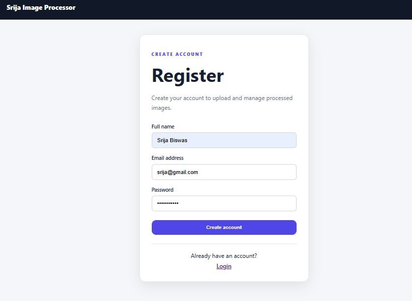
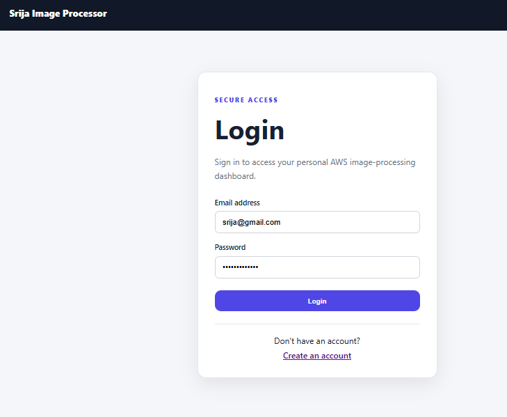
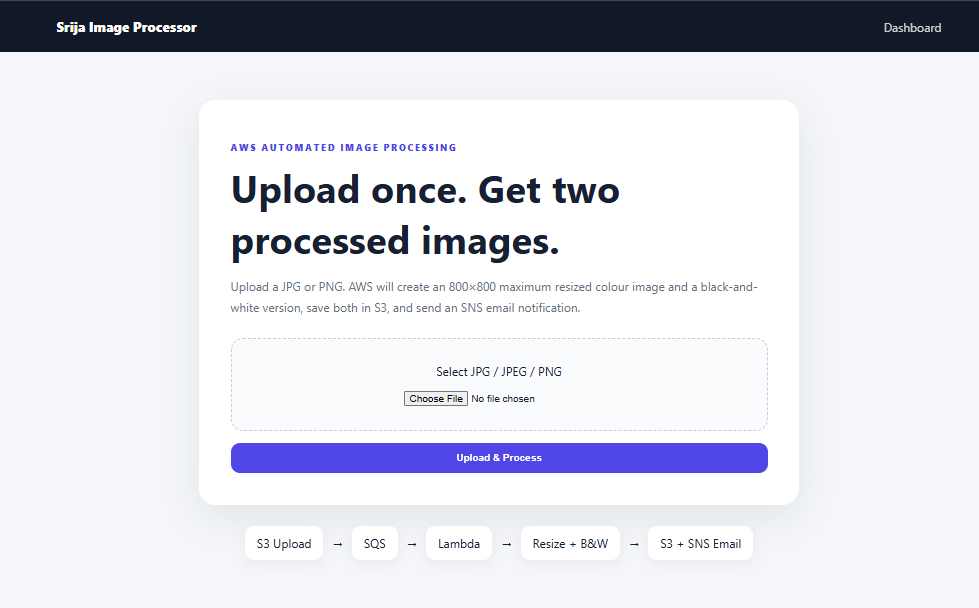
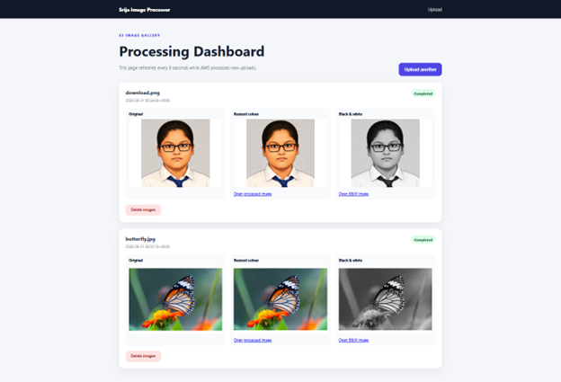
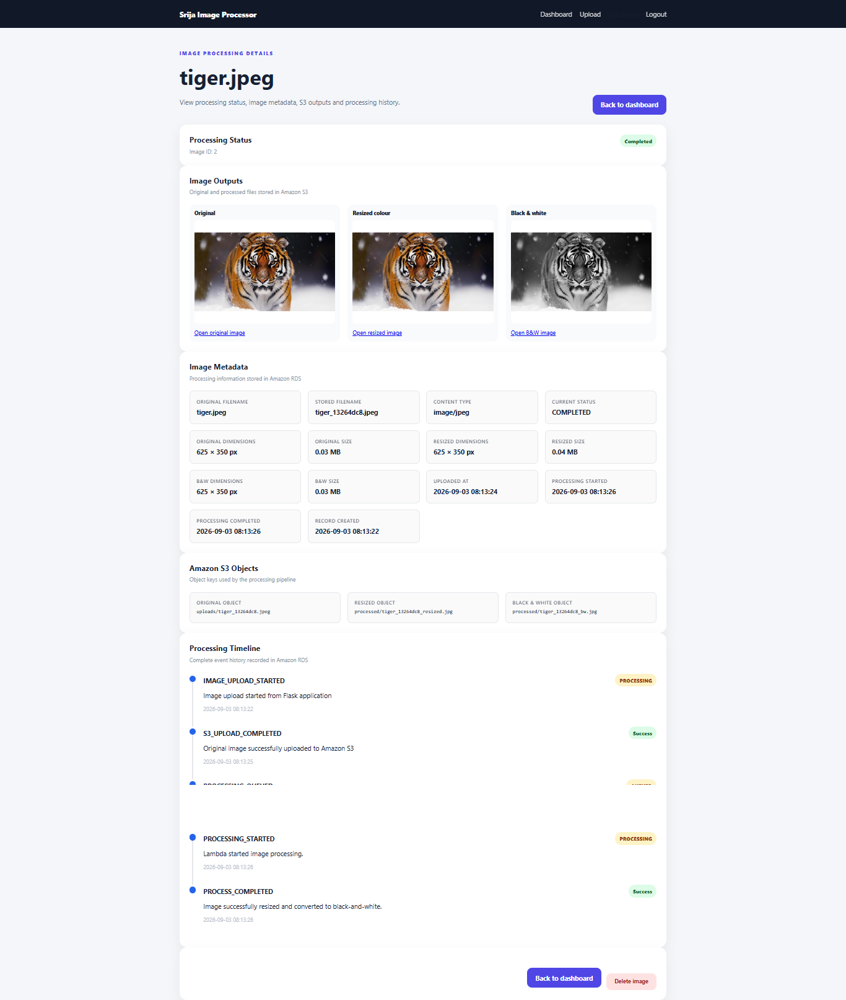

# Srija Flask + AWS Automated Image Processing System

A cloud-based, event-driven image processing application developed using **Python Flask, Amazon Web Services, Amazon RDS MySQL, AWS Lambda, Amazon S3, Amazon SQS, Amazon SNS and Pillow**.

The application provides secure user registration and login, allows authenticated users to upload images, automatically processes those images through an AWS serverless workflow, stores detailed processing information in Amazon RDS, and displays original and processed images through a Flask dashboard.

For every uploaded image, the system automatically generates:

- A resized colour image
- A black-and-white image

The application also maintains processing history, image metadata, job status, processing duration and event logs.

---

# Project Overview

The project demonstrates the integration of a traditional Flask web application with event-driven and serverless AWS services.

The complete system uses:

- **Python Flask** – web application and user interface
- **Amazon RDS MySQL** – user accounts, image metadata and processing history
- **Amazon S3** – original and processed image storage
- **Amazon SQS** – asynchronous event queue
- **AWS Lambda** – serverless image processing
- **Pillow (PIL)** – image resizing and grayscale conversion
- **PyMySQL** – Lambda and Flask connectivity with MySQL
- **Amazon SNS** – email completion notifications
- **AWS IAM** – security and access control
- **Amazon CloudWatch** – Lambda monitoring and logs
- **AWS CLI** – deployment and AWS resource management
- **HTML/CSS** – application interface

The project does **not require Amazon EC2** for image processing.

---

# Application Screenshots

## User Registration

New users can create an account before accessing the image-processing system.



## User Login

Registered users authenticate through the Flask login interface.



## Image Upload Page

Authenticated users can upload JPG, JPEG or PNG images.



## Image Processing Dashboard

The dashboard displays images belonging only to the currently authenticated user.



## Image Processing Details

The image details page provides processing metadata and event history.



---

# System Architecture

```text
                         USER
                           |
                           v
                  +----------------+
                  | Flask Web App  |
                  +----------------+
                    |            |
              Register/Login    Upload
                    |            |
                    v            v
              +----------+   +----------+
              |   RDS    |   | Amazon S3|
              |  MySQL   |   | uploads/ |
              +----------+   +----------+
                    ^            |
                    |       ObjectCreated
                    |            |
                    |            v
                    |       +----------+
                    |       |Amazon SQS|
                    |       +----------+
                    |            |
                    |            v
                    |       +----------+
                    +-------|  Lambda  |
                            | + Pillow |
                            | +PyMySQL |
                            +----------+
                              /      \
                             /        \
                            v          v
                     Resized Image   B&W Image
                             \        /
                              \      /
                               v    v
                          +-------------+
                          | Amazon S3   |
                          | processed/  |
                          +-------------+
                                |
                                v
                          +-------------+
                          | Amazon SNS  |
                          +-------------+
                                |
                                v
                         Email Notification
```

---

# Complete Workflow

```text
User
  ↓
Register / Login
  ↓
Flask Application
  ↓
Amazon RDS
  ↓
Upload Image
  ↓
Amazon S3 uploads/
  ↓
S3 ObjectCreated Event
  ↓
Amazon SQS
  ↓
AWS Lambda
  ↓
Amazon RDS → PROCESSING
  ↓
Download Original Image
  ↓
Pillow Image Processing
  ├── Resize Colour Image
  └── Create Black-and-White Image
  ↓
Amazon S3 processed/
  ↓
Amazon RDS → COMPLETED
  ↓
Amazon SNS
  ↓
Email Notification
  ↓
Flask Dashboard
```

When an authenticated user uploads an image:

1. Flask validates the image format.
2. An image record is created in Amazon RDS.
3. The upload process is recorded in `processing_events`.
4. Flask uploads the original image to Amazon S3.
5. S3 generates an `ObjectCreated` event.
6. The event is sent to Amazon SQS.
7. AWS Lambda receives the SQS message.
8. Lambda connects to Amazon RDS using PyMySQL.
9. The image status is updated to `PROCESSING`.
10. Lambda downloads the image from S3.
11. Pillow corrects image orientation if required.
12. Pillow resizes the image.
13. Pillow creates a black-and-white image.
14. Lambda uploads both processed images to S3.
15. Image dimensions, file sizes and timestamps are stored in RDS.
16. Processing job information is recorded.
17. Processing events are recorded.
18. The image status becomes `COMPLETED`.
19. Lambda generates temporary pre-signed S3 URLs.
20. Amazon SNS sends a completion email.
21. The Flask dashboard displays the processed images.

---

# User Authentication

Users can register, log in, access their dashboard, upload images, view processing details, delete images and log out.

Passwords are never stored directly. Flask uses Werkzeug:

```python
generate_password_hash()
check_password_hash()
```

Each image is linked to its owner through `user_id`.

---

# Amazon RDS MySQL

Database:

```text
image_processing
```

Main tables:

```text
users
images
processing_jobs
processing_events
```

## Users Table

Stores registered users, password hashes, account status and login timestamps.

## Images Table

Stores image ownership, filenames, S3 keys, dimensions, file sizes, processing status and timestamps.

Possible statuses:

```text
UPLOADING
UPLOADED
QUEUED
PROCESSING
COMPLETED
FAILED
```

## Processing Jobs Table

Stores:

```text
image_id
lambda_request_id
sqs_message_id
status
started_at
completed_at
processing_duration_ms
error_message
```

## Processing Events Table

Typical events:

```text
IMAGE_UPLOAD_STARTED
S3_UPLOAD_COMPLETED
PROCESSING_QUEUED
PROCESSING_STARTED
PROCESS_COMPLETED
PROCESS_FAILED
```

---

# Example RDS Processing Result

```text
Filename:
tiger.jpeg

Status:
COMPLETED

Original dimensions:
625 × 350

Resized dimensions:
625 × 350

Resized file size:
40,034 bytes

Black-and-white dimensions:
625 × 350

Black-and-white file size:
35,288 bytes

Processing duration:
631 ms
```

---

# Amazon S3

Bucket:

```text
srija-biswas
```

Structure:

```text
srija-biswas/
│
├── uploads/
│   ├── tiger_12345678.jpeg
│   └── photo_11223344.png
│
└── processed/
    ├── tiger_12345678_resized.jpeg
    ├── tiger_12345678_bw.jpeg
    ├── photo_11223344_resized.png
    └── photo_11223344_bw.png
```

Only objects created in `uploads/` trigger the pipeline, preventing recursive Lambda execution.

---

# Image Processing

AWS Lambda uses Pillow to create:

```text
Original Image
      |
      +------ Resized Colour Image
      |
      +------ Black-and-White Image
```

Maximum resize:

```text
800 × 800 pixels
```

JPEG quality is approximately:

```text
85
```

Images smaller than the maximum dimensions are not unnecessarily upscaled.

---

# Amazon SQS

Queue:

```text
srija-image-processing-queue
```

Architecture:

```text
S3 → SQS → Lambda
```

SQS provides asynchronous processing and decouples S3 from Lambda.

---

# AWS Lambda

Lambda function:

```text
srija-image-processor
```

Runtime:

```text
Python 3.12
```

The function:

- Reads SQS messages
- Extracts S3 object information
- Finds the corresponding RDS record
- Updates processing status
- Downloads the source image
- Corrects EXIF orientation
- Resizes the image
- Creates a black-and-white version
- Uploads processed files to S3
- Updates RDS metadata
- Records processing job information
- Records processing events
- Generates pre-signed URLs
- Publishes an SNS notification

---

# Lambda Layers

The function uses:

```text
srija-pillow-image-layer
srija-pymysql-layer
```

The deployment ZIP only needs:

```text
lambda_function.py
```

---

# Flask Dashboard

The dashboard can display:

```text
Original Image
Resized Colour Image
Black-and-White Image
Processing Status
Upload Timestamp
Image Details
Delete Option
```

---

# Secure Image Access

Images remain private in S3. The application generates temporary **pre-signed S3 URLs** for authenticated access.

---

# Email Notifications

SNS topic:

```text
srija-image-processing-notifications
```

After processing, Lambda sends a completion notification containing temporary links to the processed files.

---

# IAM Security

Typical Lambda permissions:

```text
s3:GetObject
s3:PutObject
sqs:ReceiveMessage
sqs:DeleteMessage
sqs:GetQueueAttributes
sns:Publish
```

The local Flask AWS identity requires the appropriate S3 permissions.

---

# VPC and RDS Connectivity

Lambda connects to RDS through the application's VPC.

```text
Lambda Security Group
        |
        | TCP 3306
        v
RDS Security Group
        |
        v
MySQL
```

---

# Environment Variables

Create a local `.env` file:

```env
AWS_REGION=us-east-1
S3_BUCKET=srija-biswas

DB_HOST=your-rds-endpoint.amazonaws.com
DB_PORT=3306
DB_NAME=image_processing
DB_USER=your_database_user
DB_PASSWORD=your_database_password

FLASK_SECRET_KEY=replace-with-a-long-random-secret
```

Never commit real secrets.

---

# CloudWatch Monitoring

```powershell
aws logs tail /aws/lambda/srija-image-processor `
  --since 10m `
  --region us-east-1
```

---

# Project Structure

```text
aws-image-processing/
│
├── app.py
├── database.py
├── README.md
├── requirements.txt
├── .gitignore
│
├── lambda/
│   └── lambda_function.py
│
├── policies/
│   ├── lambda-policy.json
│   ├── s3-notification.json
│   ├── sqs-attributes.json
│   ├── sqs-policy.json
│   └── trust-policy.json
│
├── screenshots/
│   ├── Login.png
│   ├── Register.png
│   ├── upload-page.png
│   ├── dashboard.png
│   └── Image-details.png
│
├── static/
│   └── style.css
│
└── templates/
    ├── login.html
    ├── register.html
    ├── index.html
    ├── dashboard.html
    └── image_details.html
```

---

# Technologies Used

| Technology | Purpose |
|---|---|
| Python | Backend development |
| Flask | Web application |
| Werkzeug | Password hashing and authentication |
| MySQL | Relational database |
| Amazon RDS | Managed MySQL database |
| PyMySQL | Python–MySQL connectivity |
| Pillow | Image processing |
| Amazon S3 | Image storage |
| Amazon SQS | Asynchronous message queue |
| AWS Lambda | Serverless processing |
| Amazon SNS | Email notifications |
| AWS IAM | Access management |
| Amazon VPC | Lambda/RDS networking |
| Amazon CloudWatch | Logs and monitoring |
| AWS CLI | AWS configuration and deployment |
| HTML | User interface |
| CSS | Application styling |

---

# Installation

## 1. Clone Repository

```powershell
git clone https://github.com/srijabiswas-01/aws-image-processing.git
cd aws-image-processing
```

## 2. Create Virtual Environment

```powershell
py -m venv .venv
.\.venv\Scripts\Activate.ps1
```

## 3. Install Dependencies

```powershell
py -m pip install -r requirements.txt
```

## 4. Configure AWS CLI

```powershell
aws configure list
aws sts get-caller-identity
```

## 5. Configure Environment Variables

Create `.env` using your own credentials and configuration values.

---

# Running the Flask Application

```powershell
py .\app.py
```

Open:

```text
http://127.0.0.1:5000
```

---

# Testing Image Processing

Expected workflow:

```text
Flask
 ↓
RDS
 ↓
S3
 ↓
SQS
 ↓
Lambda
 ↓
RDS
 ↓
S3 processed/
 ↓
SNS
```

Check S3:

```powershell
aws s3 ls s3://srija-biswas/processed/ `
  --region us-east-1
```

Check logs:

```powershell
aws logs tail /aws/lambda/srija-image-processor `
  --since 10m `
  --region us-east-1
```

---

# Verify RDS Image Metadata

```sql
SELECT
    id,
    original_filename,
    overall_status,
    original_width,
    original_height,
    resized_width,
    resized_height,
    resized_size_bytes,
    bw_width,
    bw_height,
    bw_size_bytes,
    processing_started_at,
    processing_completed_at
FROM images
ORDER BY id DESC
LIMIT 5;
```

# Verify Processing Jobs

```sql
SELECT
    id,
    image_id,
    lambda_request_id,
    sqs_message_id,
    status,
    started_at,
    completed_at,
    processing_duration_ms,
    error_message
FROM processing_jobs
ORDER BY id DESC
LIMIT 10;
```

# Verify Processing Events

```sql
SELECT
    id,
    image_id,
    event_type,
    status,
    message,
    event_time
FROM processing_events
ORDER BY id DESC
LIMIT 20;
```

---

# Deploying the Lambda Function

```powershell
Remove-Item .\lambda-deploy -Recurse -Force -ErrorAction SilentlyContinue
mkdir .\lambda-deploy

Copy-Item .\lambda\lambda_function.py .\lambda-deploy\lambda_function.py

Compress-Archive `
  -Path .\lambda-deploy\lambda_function.py `
  -DestinationPath .\lambda\function-rds.zip `
  -Force
```

Deploy:

```powershell
aws lambda update-function-code `
  --function-name srija-image-processor `
  --zip-file fileb://.\lambda\function-rds.zip `
  --region us-east-1
```

Wait:

```powershell
aws lambda wait function-updated `
  --function-name srija-image-processor `
  --region us-east-1
```

---

# Security Considerations

The project applies:

- Password hashing
- Private S3 objects
- Pre-signed S3 URLs
- IAM permissions
- RDS security groups
- Lambda security groups
- Environment variables
- `.gitignore` protection
- Per-user image ownership
- VPC networking

For production, AWS Secrets Manager can replace database credentials stored directly in Lambda environment variables.

---

# Benefits of the Architecture

- Full-stack Flask development
- User authentication
- Relational database integration
- Event-driven AWS architecture
- Serverless image processing
- Asynchronous message processing
- RDS processing history
- Image metadata tracking
- Secure password hashing
- Secure S3 access
- Processing job tracking
- Lambda/SQS correlation
- Cloud monitoring
- Automated email notifications
- No EC2 dependency
- Scalable serverless processing

---

# Future Improvements

- Amazon SES email attachments
- Multiple image upload
- Batch processing
- Custom resize dimensions
- Cropping and rotation
- Watermarking
- Additional filters
- Format conversion
- Direct download buttons
- SQS dead-letter queue
- CloudWatch alarms
- S3 lifecycle policies
- CloudFront delivery
- Hosted Flask deployment
- Dashboard analytics
- Password reset
- Admin dashboard
- AWS Secrets Manager
- RDS Proxy
- Duplicate SQS message protection
- Improved processing-job idempotency

---

# Conclusion

The **Srija Flask + AWS Automated Image Processing System** demonstrates a complete cloud-based image-processing architecture integrating a Flask web application with multiple AWS services.

Users can securely register and log in before uploading images through the Flask interface. Amazon RDS MySQL stores user accounts, image records, metadata, processing jobs and processing-event history.

Original images are stored in Amazon S3. S3 events are delivered through Amazon SQS to AWS Lambda, which uses Pillow to generate resized colour and black-and-white images. Lambda uploads the processed images to S3, records processing information in Amazon RDS and publishes an Amazon SNS notification.

The dashboard allows authenticated users to view their images and processing information while pre-signed S3 URLs provide temporary access to private image objects.

The final architecture demonstrates practical use of **Flask, Amazon RDS, Amazon S3, Amazon SQS, AWS Lambda, Amazon SNS, IAM, VPC networking, CloudWatch, Pillow and PyMySQL** within a single event-driven application, without requiring Amazon EC2.
